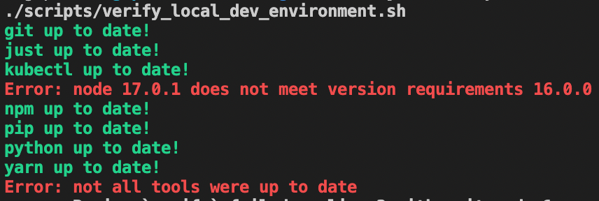

# Bash

# The Labs
The lab exercises will be introduced each day. To be able to assist as many students as possible we encourage you to submit issues on the [course's Github repository](https://github.com/hgop/syllabus-2021/issues) when you encounter problems.

If you can we encourage you to answer issues from other students.

Before you submit an issue please make sure you've checked the following:

1. Make sure the same issue has not been submitted before, check both open and closed issues. If the same or similar issue has been submitted before you can comment on the issue and/or re-open it.

2. Make sure to describe your issue using the following template, so it's easier to debug the situation:

```
Note: The following template is for guidance only, if you're just asking a question
regarding the course structure or setup or you don't feel the template is applicable 
it's fine. Otherwise, please fill in the following information.

# Expected Behaviour
What I am trying to accomplish

# Current Behaviour
What is currently happening

## Context

Please provide any relevant information about your setup. This is important in case 
the issue is not reproducible except for under certain conditions.

* Operating System:
* Other tool version you feel are relevant...

# Failure Information (for bugs)

Please help provide information about the failure if this is a bug. If it is not a 
bug, please remove the rest of this template.

## Steps to Reproduce

Please provide steps for reproducing the issue if you can:

1. step 1
2. step 2
3. you get it...

## Failure Logs

Please include any relevant log snippets, screen shots or files here.
```

# Getting to know Bash

Introduction into the bash scripting language and learning how to setup our local dev environment.

## Questions (1-2 lines each)

- [ ] What is Linux?
- [ ] What is bash?
- [ ] What is a package manager?
- [ ] What is git?
- [ ] What is npm?
- [ ] What is Pip?
- [ ] What is virtualenv?

## Objectives

- [ ] Create a repository on github for the course.
- [ ] We recommend using Linux, to set up Linux Ubuntu 20.04 on your machine (options include, mono/dual
      boot, Virtual Machine options (VMWare, VirtualBox, Parallels, Hyper-V)) **(Not necessary on macOS)**
- [ ] Install an editor of choice (e.g. VS Code)
- [ ] Install a package manager, for macOS install [Homebrew](https://brew.sh/). (apt-get is included in Ubuntu)

## Assignment

Create a bash script `scripts/verify_local_dev_environment.sh` that checks required programs/dependencies are installed.

- [ ] Make sure all bash commands are commented.
- [ ] The script should check the version of all tools.
  - [ ] git (2.x.x)
  - [ ] NodeJS (16.x.x)
  - [ ] npm (^6.x.x)
  - [ ] Python (3.8+.x)
  - [ ] Pip (20.x.x)
  - [ ] Just (0.10+)
  - [ ] Yarn (1.20+.0)
- [ ] The script should exit with error code on failures or if a required tool is not installed.

Create a [Justfile](https://github.com/casey/just) in the root of the repository.

- [ ] Create a `verify` recipe:
  - [ ] Runs `scripts/verify_local_dev_environment.sh`.
- [ ] Create a `venv` recipe:
  - [ ] Creates a python virtual environment (if it does not exist)

Example Output:


## Adding an SSH key to GitHub

1. [About SSH](https://help.github.com/articles/adding-a-new-ssh-key-to-your-github-account/)
2. [Generating a new SSH key](https://help.github.com/articles/generating-a-new-ssh-key-and-adding-it-to-the-ssh-agent/)
3. [Adding a new SSH key](https://help.github.com/articles/adding-a-new-ssh-key-to-your-github-account/)

## Create an issue on Github

Submit a new issue on the course's Github repository with the following information:

- Team members (name, email)
- Your github repository link

## How do I know I'm done?

- [ ] I have answered the questions
- [ ] I have created an executable script that completes all requirements
- [ ] I have commented the script (what is the purpose of each line or function)
- [ ] I've submitted a Github issue

## Handin

This is how your repositories should look after todays assignment which you
will submit on Friday.

repository:
```text
.
├── scripts
│   └── verify_local_dev_environment.sh
└── assignments
    └── day01
        └── answers.md
```

You should maintain the verify script through out the course for the final handin.

## Tips and tricks
Bash supports functions. Functions in bash behave like commands, not like functions in regular programming
languages. That means they have stdout, stderr and return codes.

Google can help you find a solution to almost every problem in bash. You just have to know how to phrase your search.
