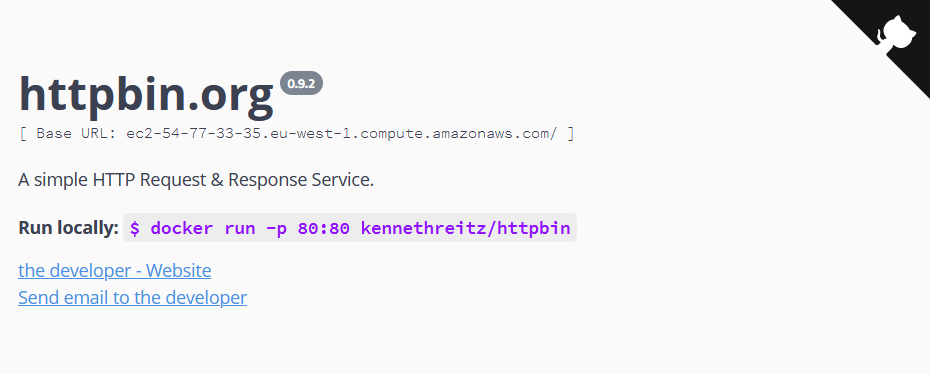

# Kubernetes

## Objectives

Today we will be setting up MicroK8s in an AWS EC2 instance. Which will host your production environment from `*.{{team-name}}.hgopteam.com`.

## Step 1 - Request Instance

[Request EC2 Instance](https://github.com/hgop/syllabus-2021/issues/10), we will create an AWS EC2 instance for you and setup a CNAME to route traffic using your teamname.

## Step 2 - Kubernetes

### Why you need Kubernetes and what it can do:

* Containers are a good way to bundle and run your applications. In a production environment, you need to manage the containers that run the applications and ensure that there is no downtime. For example, if a container goes down, another container needs to start. Wouldn't it be easier if this behavior was handled by a system?

* That's how Kubernetes comes to the rescue! Kubernetes provides you with a framework to run distributed systems resiliently. It takes care of scaling and failover for your application, provides deployment patterns, and more. For example, Kubernetes can easily manage a canary deployment for your system.

### Kubernetes provides you with:

- Service discovery and load balancing Kubernetes can expose a container using the DNS name or using their own IP address. If traffic to a container is high, Kubernetes is able to load balance and distribute the network traffic so that the deployment is stable.
- Storage orchestration Kubernetes allows you to automatically mount a storage system of your choice, such as local storages, public cloud providers, and more.
- Automated rollouts and rollbacks You can describe the desired state for your deployed containers using Kubernetes, and it can change the actual state to the desired state at a controlled rate. For example, you can automate Kubernetes to create new containers for your deployment, remove existing containers and adopt all their resources to the new container.
- Automatic bin packing You provide Kubernetes with a cluster of nodes that it can use to run containerized tasks. You tell Kubernetes how much CPU and memory (RAM) each container needs. Kubernetes can fit containers onto your nodes to make the best use of your resources.
- Self-healing Kubernetes restarts containers that fail, replaces containers, kills containers that don't respond to your user-defined health check, and doesn't advertise them to clients until they are ready to serve.
- Secret and configuration management Kubernetes lets you store and manage sensitive information, such as passwords, OAuth tokens, and SSH keys. You can deploy and update secrets and application configuration without rebuilding your container images, and without exposing secrets in your stack configuration.

To manage Kubernetes we can use kubectl.
Kubectl is a command line tool to run commands agains a kubernets cluster.

[Install Kubectl](https://kubernetes.io/docs/tasks/tools/install-kubectl/), once you are
done verify using:
```bash
kubectl version --client
```

Also remember to add `kubectl` to the setup script you created in day 1.

## Step 3 - MicroK8s

Now ssh into your instance using the keypair you created in step 2.

First you might have to change the permissions on your keyfile:

~~~bash
chmod 400 ~/.aws/keys/{{team-name}}.pem
~~~

SSH into your EC2 instance:

~~~bash
ssh -i "~/.aws/keys/{{team-name}}.pem" ubuntu@{{team-name}}.hgopteam.com
~~~

Now to setup MicroK8s in your AWS instance:

~~~bash
# Update
sudo apt update
sudo apt upgrade

# Install MicroK8s
sudo snap install microk8s --classic --channel=1.21

sudo usermod -a -G microk8s $USER
sudo chown -f -R $USER ~/.kube
~~~

Exit the ssh session and then ssh back in for the permission changes to take effect.

Wait for MicroK8s to be ready and then enable the ingress addon.

~~~bash
microk8s status --wait-ready

microk8s.enable dns ingress storage
~~~

Add DNS.6 to `/var/snap/microk8s/current/certs/csr.conf.template`:

~~~text
[ alt_names ]
DNS.1 = kubernetes
DNS.2 = kubernetes.default
DNS.3 = kubernetes.default.svc
DNS.4 = kubernetes.default.svc.cluster
DNS.5 = kubernetes.default.svc.cluster.local
DNS.6 = {{team-name}}.hgopteam.com
IP.1 = ...
IP.2 = ...
#MOREIPS
~~~

Get the kubeconfig file using:

~~~bash
microk8s config
~~~

Save the output on your local machine in `~/.kube/config` and change the
`clusters.microk8s-cluster.server` to `https://{{team-name}}.hgopteam.com:16443`, you
should share this file with other group members so they can access the cluster.

(**DO NOT** keep the kubeconfig file in your repository)

The kubeconfig file is used by kubectl to autenticate with your kubernetes instance.

Check that you can connect to your kubernetes cluster from your local machine by doing:

~~~bash
kubectl get namespaces
~~~

You should see:

~~~
NAME              STATUS   AGE
kube-system       Active    5m
kube-public       Active    5m
kube-node-lease   Active    5m
default           Active    5m
ingress           Active    5m
~~~

## Step 4 - HttpBin

Now we will deploy our first service to the cluster, we will use a public docker image called httpbin.\
It's a simple service, just to see that everything has been configured correctly for your cluster.

Create the following files:

`ingress.yaml`
~~~yaml
# TODO Comment 2-3 sentences.
apiVersion: networking.k8s.io/v1
kind: Ingress
metadata:
  name: httpbin
  labels:
    app: httpbin
spec:
  rules:
  - host: "httpbin.{{team-name}}.hgopteam.com"
    http:
      paths:
      - path: /
        pathType: Prefix
        backend:
          service:
            name: httpbin
            port:
              number: 8000
~~~

`service.yaml`
~~~yaml
# TODO Comment 2-3 sentences.
apiVersion: v1
kind: Service
metadata:
  name: httpbin
  labels:
    app: httpbin
spec:
  ports:
  - name: http
    port: 8000
    targetPort: 80
  selector:
    app: httpbin
~~~

`deployment.yaml`
~~~yaml
# TODO Comment 3-5 sentences.
apiVersion: apps/v1
kind: Deployment
metadata:
  name: httpbin
  labels:
    app: httpbin
spec:
  replicas: 1
  selector:
    matchLabels:
      app: httpbin
      version: v1
  template:
    metadata:
      labels:
        app: httpbin
        version: v1
    spec:
      containers:
      - image: docker.io/kennethreitz/httpbin
        imagePullPolicy: Always
        name: httpbin
        ports:
        - containerPort: 80
~~~

The yaml file contains a description of a service that we can deploy to our kubernetes cluster.\
The deployment tells kubernetes what image it should run, in this case a open source httpbin server listening on port 80.\
The service is an abstraction for a logical set of pods, in this case our single httpbin pod.\
The ingress tells kubernetes to forward requests for url `httpbin.{{team-name}}.hgopteam.com` to the httpbin service port 8000, which maps to port 80 in the container which is the port httpbin listens on.

Now deploy the httpbin service to your cluster:

~~~bash
kubectl apply -f ingress.yaml -f service.yaml -f deployment.yaml
~~~

Open `httpbin.{{team-name}}.hgopteam.com` in your browser.

You should see:



You can see the resources you created in the cluster using kubectl:

~~~bash
kubectl get ingress
kubectl get service
kubectl get deployment
kubectl get pods
~~~

Take the name of the httpbin pod in my case `httpbin-86956d44c4-qt27d` and lets check the logs:

~~~bash
kubectl logs httpbin-86956d44c4-qt27d
~~~

You should see everything that is printed to stdout:

~~~
[2020-11-20 19:39:04 +0000] [1] [INFO] Starting gunicorn 19.9.0
[2020-11-20 19:39:04 +0000] [1] [INFO] Listening at: http://0.0.0.0:80 (1)
[2020-11-20 19:39:04 +0000] [1] [INFO] Using worker: gevent
[2020-11-20 19:39:04 +0000] [8] [INFO] Booting worker with pid: 8
~~~

Once the webpage is up at `httpbin.{{team-name}}.hgopteam.com` you are done.

If you need to restart a pods you can simple delete it:

~~~bash
kubectl delete pod httpbin-86956d44c4-qt27d
~~~

Kubernetes will automatically start a new one.

## Step 5 - Connect4

Copy the YAML files into your repository and rename it to `{{name}}.template.yaml`.

Change the YAMLs so that the connect4 client is available at: `connect4.{{team-name}}.hgopteam.com`
and you use the image your pushed to docker hub in day 02.

## Step 6 - HTTPS

Now we'll create a HTTPS certificate through letsencrypt, this can be done rather easily using
[cert-manager](https://github.com/jetstack/cert-manager) kubernetes addon.

Install cert-manager:

~~~bash
kubectl apply -f https://github.com/jetstack/cert-manager/releases/download/v1.6.1/cert-manager.yaml
~~~

Lets start by testing against the letsencrypt staging server:

`letsencrypt-staging.yaml`
~~~bash
apiVersion: cert-manager.io/v1
kind: ClusterIssuer
metadata:
  name: letsencrypt-staging
spec:
  acme:
    # The ACME server URL
    server: https://acme-staging-v02.api.letsencrypt.org/directory
    # Email address used for ACME registration
    email: you@example.com
    # Name of a secret used to store the ACME account private key
    privateKeySecretRef:
      name: letsencrypt-staging
    # Enable the HTTP-01 challenge provider
    solvers:
    - http01:
        ingress:
          class: public
~~~

Apply the issuer after you have filled in your email.

~~~bash
kubectl apply -f letsencrypt-staging.yaml
~~~

Check the registration status:

~~~bash
kubectl describe clusterissuer letsencrypt-staging
~~~

You should see:

~~~
Message: The ACME account was registered with the ACME server
~~~

Now update your httpbin ingress:

~~~yaml
metadata:
  annotations:
    cert-manager.io/cluster-issuer: "letsencrypt-staging"
spec:
  tls:
  - hosts:
    - "httpbin.{{team-name}}.hgopteam.com"
    secretName: httpbin-tls-staging
~~~

Wait until the `httpbin-tls-staging` certificate is ready.

~~~bash
kubectl get certificate
~~~

You should be able to access your httpbin service using https at `https://httpbin.{{team-name}}.hgopteam.com` (You will get a warning from your browser about an unsigned certificate because we are using letsencrypt's staging environment).

Now lets remove the staging issuer and certificate and setup a production certificate.

~~~bash
kubectl delete clusterissuer letsencrypt-staging
kubectl delete ingress httpbin
kubectl delete secret httpbin-tls-staging
~~~

Create a production one:

~~~yaml
apiVersion: cert-manager.io/v1
kind: ClusterIssuer
metadata:
  name: letsencrypt
spec:
  acme:
    # The ACME server URL
    server: https://acme-v02.api.letsencrypt.org/directory
    # Email address used for ACME registration
    email: you@example.com
    # Name of a secret used to store the ACME account private key
    privateKeySecretRef:
      name: letsencrypt
    # Enable the HTTP-01 challenge provider
    solvers:
    - http01:
        ingress:
          class: public
~~~

~~~yaml
metadata:
  annotations:
    cert-manager.io/cluster-issuer: "letsencrypt"
spec:
  tls:
  - hosts:
    - "httpbin.{{team-name}}.hgopteam.com"
    secretName: httpbin-tls
~~~

Now setup HTTPS for the connect4 client as well. Update the `ingress.template.yaml` to include
these HTTPS changes. The `ClusterIssuer` resource does not need to exist in the repository.

### How do I know I'm done?

- [ ] `https://httpbin.{{team-name}}.hgopteam.com` is working.
- [ ] `https://connect4.{{team-name}}.hgopteam.com` is working.
- [ ] Comment the httpbin yaml template files.

This is how your repository should look after todays assignment which you will submit on Friday.

repository:
```bash
.
├── assignments
│   ├── day01
│   │   └── answers.md
│   └── day02
│       └── answers.md
├── scripts
│   └── verify_local_dev_environment.sh
└── src
    ├── connect4-client
    │   ├── k8s
    │   │   ├── deployment.template.yaml
    │   │   ├── ingress.template.yaml
    │   │   └── service.template.yaml
    │   ├── public
    │   │   ├── ...
    │   │   └── index.html
    │   ├── src
    │   │   ├── ...
    │   │   ├── index.tsx
    │   │   └── App.tsx
    │   ├── .dockerignore
    │   ├── .gitignore
    │   ├── Dockerfile
    │   ├── tsconfig.json
    │   ├── package-lock.json
    │   └── package.json
    └── httpbin
        └── k8s
            ├── deployment.template.yaml
            ├── ingress.template.yaml
            └── service.template.yaml
```
